# Supply Chain Forecasting Methods & ML/AI Emissions

**Live demo:** https://emissions.supplychainbrutus.com

A live forecasting tools catalog that demonstrates the carbon footprint of ML/AI operations. Built for graduate supply chain management courses at OSU Fisher College of Business.

## Purpose

This tool runs classical forecasting methods (naive, ARIMA, exponential smoothing, etc.) while tracking the carbon emissions of each API request using CodeCarbon. It reveals:
- Per-request emissions with real-world comparisons
- At-scale projections (10k and 500k users)
- Live class-wide aggregate emissions
- Optional parameter optimization (AIC grid search for ARIMA, SSE minimization for exponential smoothing)

The frontend includes a TL;DR dropdown that frames the compute stack as a teaching analogy for Scope 1/2/3 emissions in a physical supply chain:
- **Scope 1**: Direct emissions from each forecast request (measured live with CodeCarbon)
- **Scope 2**: Grid energy keeping the server alive regardless of traffic
- **Scope 3**: Embodied carbon in hardware, model training, student devices, and the AI that built the tool

## Pedagogy



This tool is designed for undergraduate and graduate students in supply chain management, business analytics, or any course that touches AI, sustainability, or quantitative methods. It serves a dual pedagogical purpose: students interact with it as a functional forecasting catalog, selecting methods, adjusting parameters, and generating 12-period forecasts on a synthetic demand dataset with known structure. Underneath, every forecast call is measured in real time using CodeCarbon, accumulating a live class-wide emissions total that is visible on screen. The tool is intentionally approachable -- no installation, no login, no code -- so that the barrier to entry is zero and the entire class session can focus on interpretation rather than setup. Undergraduates can engage at the level of method comparison and emissions intuition; graduate students can go deeper into methodology, measurement validity, and scope accounting.

The reveal structure is the core of the lesson. Students use the tool without knowing its carbon cost, then the instructor surfaces the full emissions accounting: per-request Scope 1 cost (measured), server idle Scope 2 cost (calculated), and the largely invisible Scope 3 upstream costs including the AI-assisted development process that built the tool itself. The build session -- running local open-source models on GPU hardware with CodeCarbon monitoring the entire session -- produced a measured footprint that dwarfs the entire class's runtime usage combined. That ratio, and the methodological gaps in what can and cannot be measured, mirrors the Scope 3 data challenges students will face in industry when auditing AI tool procurement decisions. The discussion question writes itself: what would you need to know that we couldn't measure today?

## Architecture

```
┌─────────────┐         ┌─────────────┐         ┌─────────────┐
│  User       │ ← HTTP →│  FastAPI    │ ← wraps →│ CodeCarbon  │
│  (Browser)  │         │  Backend    │          │ Tracker     │
└─────────────┘         └─────────────┘         └─────────────┘
       │                       │
       │                       ↓
       │              ┌─────────────┐
       └────────────→│  SQLite      │
                     │  Aggregate   │
                     └─────────────┘
```

## Frontend Features

- **Light/dark mode toggle** with localStorage persistence (moon/sun icon in header)
- **TL;DR dropdown** explaining Scope 1/2/3 emissions analogy
- **Loading spinner** on the Run Forecast button while requests are in flight
- **Optimization warnings** — confirm dialog before running expensive grid searches (SARIMA, ARIMA, ARIMAX, Holt-Winters, Auto ARIMA)
- **Methodology dropdown** explaining how CodeCarbon measures emissions
- **Real-world comparisons** — randomized analogies for emission values at every scale
- **Responsive layout** — collapses to single column on mobile

## Local Development

### Prerequisites

- Python 3.11+
- CodeCarbon installed locally: `pip install -e ~/codecarbon`

### Setup

```bash
cd ~/projects/digital_sc_emissions
python3 -m venv venv
source venv/bin/activate
pip install -r backend/requirements.txt
```

### Run Backend

```bash
cd backend
uvicorn main:app --reload --host 0.0.0.0 --port 8010
```

Open http://localhost:8010 in your browser. The frontend is served from the same FastAPI server.

## EC2 Deployment

### EC2 Instance Setup

1. Launch t3.small (Amazon Linux 2023, us-east-2)
2. Open port 8010 in security group (0.0.0.0/0)
3. SSH into instance

### Deployment Steps

```bash
# Install Python
sudo dnf install python3.11 python3.11-pip -y

# Create venv
python3.11 -m venv ~/forecast_env
source ~/forecast_env/bin/activate

# Install CodeCarbon
pip install codecarbon

# Install project dependencies
pip install fastapi "uvicorn[standard]" statsmodels pmdarima numpy pandas

# Copy backend/ directory from your machine

# Run with start.sh
chmod +x start.sh
./start.sh &
```

Backend will be accessible at `http://<EC2_PUBLIC_IP>:8010`

## Frontend Serving

The frontend is served directly by FastAPI. The `GET /` route in `backend/main.py` returns `frontend/index.html` as a `FileResponse`. No separate static file server is needed — uvicorn handles both the API and the frontend on port 8010.

## Post-Session Analysis

After the build session, run the analysis tool to calculate emissions per inference:

```bash
cd tools
python session_analysis.py /path/to/opencode_session_log.json /path/to/emissions_detail.csv
```

Outputs:
- Formatted table to stdout
- JSON summary to `build_session_summary.json`

## Synthetic Dataset

`data/generate_synthetic.py` produces `data/synthetic_demand.csv` with:
- 156 weeks (3 years) of weekly demand
- True DGP: SARIMA(1,1,1)(1,1,0,52)
- Base demand: 500 units/week
- Linear trend: +0.8 units/week
- Seasonal amplitude: 80 units (holiday peak at weeks 48-52)
- Level shift: +120 units starting week 78
- Exogenous: temperature (°F) affecting demand

Run once to generate:
```bash
cd data
python generate_synthetic.py
```

## Files

```
~/projects/digital_sc_emissions/
├── backend/
│   ├── main.py              # FastAPI endpoints
│   ├── forecaster.py        # 10 forecasting methods + optimization
│   ├── emissions_tracker.py # CodeCarbon wrapper
│   ├── aggregate.py         # SQLite session logging
│   ├── requirements.txt     # Python deps
│   └── start.sh             # Startup script (port 8010)
├── frontend/
│   └── index.html           # Single-file SPA (light/dark mode, spinner, TL;DR)
├── data/
│   ├── generate_synthetic.py
│   └── synthetic_demand.csv
├── tools/
│   └── session_analysis.py  # Post-session join
└── README.md
```

## Methods Implemented

- **Baseline**: Naive, Seasonal Naive, Simple Moving Average
- **Exponential Smoothing**: SES, Holt (Linear), Holt-Winters (Triple)
- **ARIMA Family**: ARIMA, SARIMA, ARIMAX (with exog), Auto ARIMA

All exponential smoothing and ARIMA methods support optional parameter optimization.

## Built With

- **Models**: Qwen3.5:27b, Gemma4:27b, gpt-OSS:20b via OpenCode
- **Supervision**: Claude Code
- **Carbon tracking**: [CodeCarbon](https://codecarbon.io/)

## Notes

- CodeCarbon 3.x auto-detects region via IP geolocation
- Aggregate database persists in SQLite between restarts
- GPU power read via NVML (development machine only)
- EC2 has no GPU — falls back to CPU TDP estimates
- Frontend includes a methodology dropdown explaining how emissions are measured
- Optimization on SARIMA with s=52 can take several minutes (grid search across ~54 model combinations)
